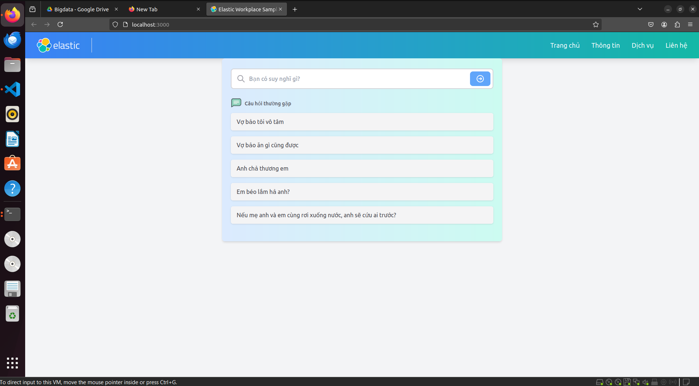

# Clara - Thấu hiểu phụ nữ
Clara là một công cụ hỗ trợ tương tác, giúp người dùng hiểu rõ hơn về ngôn ngữ, ý nghĩa ẩn giấu trong lời nói của phái đẹp. Không chỉ cung cấp giải nghĩa chi tiết, có độ tin cậy cao, đồng thời bạn cũng nhận được hướng dẫn xử lý tình huống cụ thể và phù hợp.

Với mục tiêu trở thành người bạn đồng hành thông minh, chatbot được thiết kế để giúp bạn hiểu sâu hơn và giao tiếp hiệu quả hơn, xây dựng mối quan hệ dựa trên sự thấu hiểu và tôn trọng.




## Công nghệ:
- Corrective RAG
- ElasticSearch
- Langchain
- Tavily Search


## Thành viên nhóm:
- Nguyễn Gia Lộc - 22022554
- Đỗ Tiến Dũng - 22022557
- Vũ Minh Khải - 22022556
- Trần Đức Đăng Khôi - 22022552


## Báo cáo:


## Slide:


## Tải về

```bash
git clone https://github.com/LocCongNghe/chatbot_rag
```


## Cài đặt và kết nối Elasticsearch

### Cài đặt Elasticsearch

Cách tốt nhất là sử dụng elstic cloud. [Hướng dẫn](https://www.elastic.co/search-labs/tutorials/install-elasticsearch)

### Kết nối Elasticsearch

Cài đặt các biến môi trường sau để kết nối với Elaticsearch được lưu trữ trên Elastic Cloud:

```sh
export ELASTIC_CLOUD_ID=...
export ELASTIC_API_KEY=...
export ELASTICSEARCH_URL=...
export ELASTICSEARCH_USERNAME=...
export ELASTICSEARCH_PASSWORD=...
```

Tạo tệp `.env` từ tệp mẫu `env.example` 

## Kết nối LLM

### OpenAI

Cung cấp OpenAi key thông qua biến `OPENAI_API_KEY` trong tệp .env:

```sh
export LLM_TYPE=openai
export OPENAI_API_KEY=...
```

Bạn có thể nhận OpenAi key tại [OpenAI dashboard](https://platform.openai.com/account/api-keys).

## Chạy

Với các biến môi trường được đặt, bạn có thể chạy các lệnh sau để khởi động máy chủ và giao diện người dùng.

#### Điều kiện tiên quyết
- Python 3.8+
- Node 14+

#### Cài đặt các thư viện liên quan

Tạo môi trường ảo và cài đặt các thư viện liên quan.

```sh
# Tạo môi trường ảo
python3 -m venv .venv

# Kích hoạt môi trường ảo
source .venv/bin/activate

# Cài đặt các thư viện liên quan
pip install -r requirements.txt
```

#### Chạy
Tại thư mục ứng dụng, mở 2 terminal chạy 2 đoạn code sau:
```sh
source .venv/bin/activate
flask create-index
flask run
```

và

```sh
cd frontend
yarn start
```

